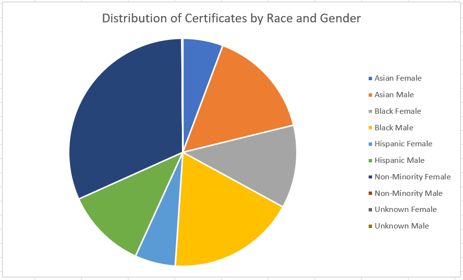
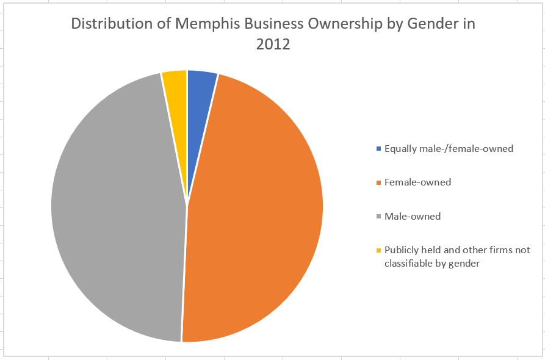

# Bowerman_Tran_Midterm

## Background

We, as Hopkins students, are also part of the Baltimore community. We are always interested in seeing what and why the city is lacking, as well as any positive developments and potential improvements. Combining that outlook with our interest in equity, we want to explore the business/entrepeneurial landscape of Baltimore city, specifically for groups that are perhaps overlooked or undersupported in their endeavors: women and minorities. In this project, we are studying women- and minority-owned Baltimore businesses contracted by the city government in order to comment on how city government funding and support has been allocated. Above all, we want to discover if these contract percentages are reflective of both business ownership and resident demographics. Additionally, we are comparing our findings to government contracts for women- and minority-owned businesses in New York City and Memphis, to see if the issues and trends we detected are also present.

## Baltimore Findings
### Certificate distribution by business owner's race and service category in Baltimore

Construction companies made up the bulk of the certificates outstanding in 2012, at PERCENTAGE, with Professional Services and Services coming at second and third at PERCENTAGE and PERCENTAGE, respectively.

### Certificate distribution by business owner's race and gender in Baltimore

We found that African American men made up the largest MBE subgroup at PERCENTAGE, while white women made up the largest WBE subgroup at PERCENTAGE. African American women made up the second largest subgroup for either category, at PERCENTAGE.

### Certificate service category breakdown by gender and race in Baltimore

Here we see that the traditionally underrepresented groups in professional services are still underrepresented here, with the exception being the Female African American subset.

### M/WBE breakdown, 2012

### Baltimore business owner race and gender demographics, 2012

Here we see that representation in business ownership is consistent with population demographics. The data suggests that there is no gender imbalance.

## New York Findings
### M/WBE breakdown, 2020

Compare to Baltimore

### New York City business owner race and gender demographics, 2012

Insert images of census race and gender business ownership breakdowns and M/WBE breakdown; Commentary and compare to Baltimore

## Memphis Findings
### Memphis business owner race and gender demographics, 2012

### M/WBE breakdown, 2019

Here we see Memphis' population demographics (above) and the city's spending on businesses of various fields (below). While the city has a similar population demographic to Baltimore, its MWBE does not receive the same level of support. 

## Data and Information Sources

1) The minority and women's business certifications and city contract awards data for Baltimore from 2012 (uploaded in 2017) was found using the [Open Baltimore data portal](https://data.baltimorecity.gov/ "Open Baltimore").
2) The minority and women's business certifications and city contract awards data for New York City from 2020 was found using the [NYC Open Data portal](https://opendata.cityofnewyork.us/ "NYC Open Data").
3) The general demographic data for all cities from 2012 was found using the [U.S. Census FactFinder portal](https://factfinder.census.gov/faces/nav/jsf/pages/index.xhtml/ "American FactFinder"). After March 31, 2020, available [here](https://data.census.gov/cedsci/ "Census Data").
4) The general demographic data for Baltimore City (updated 2019) was found using the [U.S. Census FactFinder portal](https://www.census.gov/quickfacts/fact/table/baltimorecitymaryland,US/PST045219/).
5) The FY19 Minority & Women Owned Business (MWBE) Spend Report was found using the [Memphis Data Hub](https://data.memphistn.gov/browse?q=women&sortBy=relevance).

## Data Questions

1) What percentage of the city government's contracts are awarded to Minority and Women's Business Enterprise-Certified companies?
2) Is this percentage reflective of city demographics and business ownership as a whole?
3) What are some interesting trends in city contracts and MBE/WBE-certified companies?
4) Can the data from both Baltimore and other cities be used to create a benchmark for the city government's contract diversity today?

## Data Analysis

We will look at:

1) Businesses' profiles: industry, owner's race and gender, scope and size of work (via contract sizes) for Baltimore
2) If any particular demographic(s) are outperforming others, and why
3) Whether contract details and numbers are reflective of city demographics
4) Comparable data for New York City and Memphis

## Data Manipulation

The following methods and commands were used:

1) Used PivotTables to isolate data and sort entries into respective demographics. Made charts to spot trends and differences.
2) Used IF statements, VLOOKUP, and the Text to Columnn function to organize the datasets.
3) Used Excel's mathematical functions to calculate sums and percentages after refining original data

